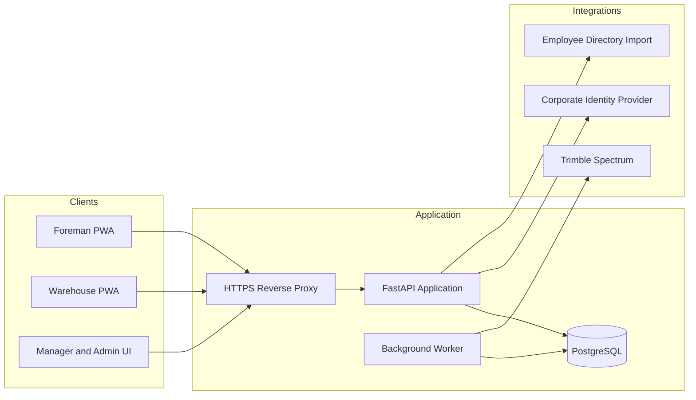

# Haynes Inventory Platform Architecture Plan

## 1. Purpose

Haynes Electric currently records warehouse material requests on paper and enters them into Trimble Spectrum at the end of the day. This creates delayed inventory information, morning congestion at the warehouse counter, limited order visibility, and difficulty locating items.

This project will provide a mobile-first inventory and material-request application that:

- Replaces paper requests with live digital workflows.
- Shows physical stock, reserved demand, and shortages as orders are submitted.
- Gives every stock position a searchable warehouse location.
- Uses QR codes to find items, create requests, and verify picks.
- Gives foremen request status and order history.
- Gives warehouse workers a prioritized fulfillment queue.
- Records every inventory change with an attributable audit trail.
- Sends only applicable inventory transactions to Spectrum.
- Supports local development accounts while production identity is confirmed.

The initial pilot is scoped to one warehouse, fewer than 50 users, company-managed phones or tablets, warehouse-only access, and in-app notifications.

## 2. Architecture Summary

The recommended implementation is a modular monolith rather than microservices. This keeps deployment and operations manageable while retaining clear module boundaries for future growth.



### Technology choices

- **Frontend:** React, TypeScript, Vite, and an installable Progressive Web App.
- **Backend:** Python FastAPI modular monolith.
- **Database:** PostgreSQL with SQLAlchemy and Alembic migrations.
- **Background processing:** PostgreSQL-backed transactional outbox and worker.
- **API contract:** OpenAPI generated by FastAPI, with a generated TypeScript client.
- **Deployment:** Immutable containers behind an HTTPS reverse proxy.
- **Local development:** Docker Compose, PostgreSQL, seeded users, and a fake Spectrum adapter.

Kubernetes is not required for the pilot.

## 3. Users and Permissions

### Foreman

- Search inventory by item number, description, and location.
- View stock, reservations, shortages, and map location.
- Scan an item QR code and add it to a draft request.
- Select a job and applicable cost code for Spectrum-managed material.
- Submit normal or urgent requests.
- View request status and history.
- Repeat a previous request.

### Warehouse worker

- View and claim requests from a shared queue.
- See urgent requests first while preserving existing allocations.
- Follow a location-ordered pick list.
- Verify locations and items by QR scan.
- Record partial picks, shortages, approved substitutions, and handoff.
- Edit or cancel submitted requests with an audit reason.
- Record general-use withdrawals for themselves or another employee.

### Inventory manager

- Perform all warehouse-worker functions.
- Import and classify items.
- Manage UOM conversions and approved substitutes.
- Reallocate scarce stock with a required reason.
- Receive, return, move, count, adjust, quarantine, and release inventory.
- Resolve offline conflicts and failed Spectrum synchronization.
- Review inventory and order history.

### System administrator

- Manage users, role mappings, devices, and application configuration.
- Configure warehouses, locations, map grids, and QR labels.
- Configure identity and Spectrum integrations.
- View integration health and audit records.

### Employee recipient

An imported employee may be selected as the recipient of a general-use withdrawal without receiving an application login. If the employee has an application account, the employee may perform a self-service general-use withdrawal.

## 4. Item and Inventory Paths

Every item has an explicit, audited `inventory_path`. Workers cannot choose the path during an order or withdrawal.

### `spectrum_managed`

- Spectrum owns the item/SKU and job/project masters.
- The inventory app owns warehouse locations, pending demand, allocations, picks, and the live operational ledger.
- Requests require an active Spectrum job.
- A cost code is required when verified Spectrum rules require one.
- Actual issued quantities are sent to Spectrum after handoff.
- Production workflows are enabled only when their Spectrum posting and reconciliation paths have been proven.

### `local_general_use`

- The inventory app owns catalog details, locations, quantities, receipts, counts, and usage history.
- Items may appear in the same advance request as Spectrum-managed items.
- No job or cost code is required.
- Transactions never enter the Spectrum outbox.
- A fast scan-and-take flow can decrement stock without creating a full request.
- Each withdrawal records the actor, recipient, item, quantity, unit, location, timestamp, and optional note.

A usage-log-only path and serialized tool custody are excluded from the first release. They can be added later as separate policies rather than overloaded onto these two paths.

## 5. Identifiers and Warehouse Locations

### Item identifiers

An item uses:

- An internal immutable UUID.
- A human-readable SKU or item number.
- A Spectrum item identifier when applicable.

A physical location must not be embedded in the permanent item ID because stock can move and one item can exist in several locations.

### Location identifiers

Locations use a readable hierarchy:

```text
Warehouse -> Zone -> Aisle -> Bay -> Shelf -> Position/Bin
```

Example:

```text
WH1-A03-B07-S02-P04
```

The code is readable over the phone and can be printed beside the QR label. Location records retain stable internal IDs so renaming a display code does not corrupt history.

### QR identifiers

QR labels contain an opaque, revocable token or URL rather than inventory quantities or sensitive data.

- A foreman scan opens item and location context, then asks for confirmation before adding the item to a draft.
- A worker scan verifies that the expected location and item are being picked.
- A location scan opens the location and the stock positions stored there.
- Manual fallback is supported for damaged labels and requires a reason during fulfillment.
- Reprinting or renaming does not require changing the underlying item identity.

## 6. Warehouse Map

The pilot uses a configurable schematic grid rather than CAD, BIM, or an uploaded floor plan.

Administrators configure:

- Zones and aisles.
- Ordered bays within each aisle.
- Shelves and bin positions.
- Display orientation and pick sequence.
- Staging locations.

Item details and pick tasks deep-link to the relevant grid cell and highlight it. The model supports multiple stock positions for the same item.

## 7. Quantity Model

The system must retain separate quantity concepts rather than collapsing them into one balance:

- `on_hand`: usable physical stock controlled by the application.
- `quarantined_qty`: physical stock unavailable for normal allocation.
- `reserved_demand`: all outstanding submitted demand.
- `allocated_qty`: physical stock assigned to specific request lines.
- `free_to_promise`: usable stock not already allocated.
- `shortage_qty`: demand that cannot currently be covered.
- `picked_qty`: material removed from its storage position but not yet issued.
- `issued_qty`: material physically handed off.
- `cancelled_qty`: demand intentionally closed without issue.
- `backordered_qty`: unfulfilled demand remaining open.

Submitted demand may exceed physical stock, but allocation, picking, and issue may not create nonexistent stock.

### Display convention

The user-facing design will retain the requested compact presentation:

```text
70 available
-40 reserved
30 uncommitted
```

For demand greater than physical stock:

```text
10 available
-16 reserved
6 short
```

The reserved and shortage values should use smaller warning-colored text, but never rely on color alone. Terminology must be tested with warehouse users because `available` can be confused with `free to promise`.

## 8. Request and Fulfillment Workflow

### Request creation

1. A foreman creates a request, or an authorized warehouse user creates one for a foreman.
2. The system preserves both the creator and recipient identities.
3. The request may contain Spectrum-managed and local-general-use lines.
4. Spectrum-managed lines require a valid job and applicable cost code.
5. Urgent requests require a reason.
6. Submission immediately contributes to reserved demand.

### Reservation and allocation

- Allocation order is urgent priority first, then submission time.
- Existing allocations are not silently taken by a later urgent request.
- An inventory manager may reallocate stock with a required reason.
- Affected requests receive an in-app notification and timeline event.
- If demand exceeds stock, the physically fulfillable portion is allocated and the remainder is backordered.
- Reservation and allocation occur in database transactions with row-level locking.

### Warehouse fulfillment

1. Submitted requests enter a shared queue.
2. A warehouse worker claims a request atomically.
3. The application orders lines by warehouse pick sequence.
4. The worker scans the location and item.
5. The worker records picked quantities and shortages.
6. Substitution is limited to administrator-maintained approved alternate SKUs and requires a reason.
7. Material can be staged before handoff.
8. The worker confirms final quantities and the physical handoff.
9. Local inventory is updated immediately.
10. Applicable Spectrum lines are placed in the outbox.

### Partial fulfillment

An order may have multiple fulfillment batches. Only actual issued quantities are sent to Spectrum. The remainder stays backordered until it is issued or cancelled.

### Request states

```text
draft
  -> submitted
  -> claimed
  -> in_progress
  -> ready
  -> partially_fulfilled
  -> completed
```

`on_hold` and `cancelled` are controlled branches. Individual request lines track requested, allocated, picked, issued, cancelled, and backordered quantities independently.

After submission, warehouse roles control edits and cancellation. Every change is audited and shown to the foreman.

## 9. Inventory Ledger

Inventory is represented through append-only events rather than editable history. Balance projections are derived transactionally from those events.

Supported event categories include:

- Spectrum-managed material issue.
- Local general-use withdrawal.
- Stock receipt and restocking.
- Jobsite return with condition.
- Move between locations.
- Cycle-count adjustment.
- Quarantine and release.
- Manager correction.

Every event includes actor, recipient when applicable, item, location, quantity, UOM, reason/reference, source workflow, and timestamp. Normal actions cannot produce negative usable stock. Manager corrections require a reason and cannot delete prior events.

## 10. Spectrum Integration

The application uses a provider interface so domain logic does not depend on vendor payloads.

```text
SpectrumAdapter
  - list_items()
  - list_jobs()
  - list_cost_codes()
  - post_issue()
  - post_receipt()
  - post_return()
  - post_adjustment()
  - find_transaction()
  - reconcile()
  - health()
  - capabilities()
```

Not every method is assumed to be supported. The production adapter exposes a verified capability matrix, and unsupported Spectrum-managed workflows remain disabled.

### Required discovery

Before implementing the real adapter, Haynes must obtain authorized documentation or assistance from its Spectrum administrator or Trimble representative and confirm:

- The licensed customer-accessible integration mechanism.
- Sandbox or non-production access.
- Authentication and service-account requirements.
- Company, warehouse, item, job, and cost-code identifiers.
- Supported read and write transactions.
- UOM and transaction validation rules.
- Idempotency or transaction lookup behavior.
- Response identifiers and error formats.
- Rate limits, pagination, and reconciliation queries.
- How integration events are attributed in Spectrum.

The OpenAPI representation shown on Trimble App Xchange is described by Trimble as internal App Xchange functionality and not an API directly accessible to customers. It must not be treated as an implementation contract.

### Transactional outbox

Completing a warehouse handoff commits the local ledger event and its outbox event in the same PostgreSQL transaction.

The worker then:

1. Reads pending outbox events.
2. Sends them with a stable business reference.
3. Records every attempt and response.
4. Retries transient failures with backoff and jitter.
5. Does not retry permanent validation failures automatically.
6. Moves exhausted failures to a visible review queue.
7. Reconciles local and Spectrum transactions on a schedule.

Warehouse fulfillment remains completed if Spectrum is temporarily unavailable. Its separate sync status can be `pending`, `succeeded`, `failed`, or `requires_review`.

## 11. Authentication and Identity

A Spectrum login does not prove that Haynes uses LDAP. Production authentication remains provider-neutral until Haynes IT identifies the actual source.

### Development

Seeded local accounts cover:

- Employee.
- Foreman.
- Warehouse worker.
- Inventory manager.
- System administrator.

Passwords are securely hashed, test credentials are non-production, and configuration must make it impossible to enable development authentication accidentally in production.

### Production preference

1. OIDC through Microsoft Entra ID or another corporate identity provider.
2. Direct LDAPS only if Haynes IT confirms it is required.
3. Local production accounts only as a formally approved fallback.

The backend enforces all authorization. The browser uses secure, same-origin, HTTP-only sessions with CSRF protection. Shared warehouse accounts are prohibited because they destroy individual accountability.

### Employee recipients

A minimal employee ID/name directory can be imported separately from login identities. This permits workers to record a withdrawal for someone who never signs into the application.

## 12. Offline Operation

Offline capability is intentionally bounded to avoid conflicting inventory administration.

### Available offline

Only requests claimed while online can continue offline, for at most one work shift:

- View the claimed task snapshot.
- Record location and item scans.
- Record picked quantities.
- Record worker-confirmed handoff.

### Online-only actions

- Submit or claim requests.
- General-use quick withdrawal.
- Receive, return, move, count, or quarantine stock.
- Edit catalog, locations, roles, or integrations.

### Offline command model

Each command contains:

- Client-generated command UUID.
- Actor and device identity.
- Request-scoped offline grant.
- Request and base version.
- Command type and ordered sequence.
- Client timestamp.

Commands are stored in an encrypted, actor-bound IndexedDB queue. Switching users does not expose, reassign, or discard another worker's queued commands. When connectivity returns, the server processes commands in order and idempotently.

Version, stock, or state conflicts enter a visible manager exception queue. The system must never silently use last-write-wins for inventory. Revoking a user or device invalidates outstanding grants at synchronization.

## 13. Frontend Structure

The frontend is organized by user workflow rather than by generic component category:

```text
frontend/src/
  app/
  api/
  features/
    auth/
    inventory/
    locations/
    requests/
    fulfillment/
    general-use/
    offline-sync/
    notifications/
    administration/
    audit/
  offline/
  shared/
```

UX requirements include:

- Mobile-first layouts for phones and tablets.
- Large, stable scan and quantity targets.
- Minimal typing and numeric keypads where appropriate.
- Item description, photo when available, UOM, location, and quantity visible before confirmation.
- Persistent offline and pending-sync status.
- Manual alternatives for failed scans.
- Clear confirmation for destructive or irreversible actions.
- Accessible contrast, keyboard navigation, screen-reader labels, zoom, and touch targets.
- No email, SMS, or browser push during the pilot.

## 14. Backend Structure

The backend is organized into vertical domain modules:

```text
backend/app/
  main.py
  config.py
  platform/
    database/
    security/
    logging/
  modules/
    identity/
    recipients/
    catalog/
    locations/
    inventory/
    requests/
    fulfillment/
    offline/
    notifications/
    audit/
    spectrum/
  workers/
```

HTTP handlers validate and serialize requests but do not own business rules. Transactional services enforce permissions, state transitions, quantity invariants, ledger creation, and outbox creation.

## 15. Data Model

The minimum entities are:

- `Warehouse`
- `User`
- `RoleAssignment`
- `EmployeeRecipient`
- `Device`
- `Item`
- `ItemAccountingPolicy`
- `UnitOfMeasure`
- `UnitConversion`
- `ApprovedAlternate`
- `Location`
- `MapGridCell`
- `StockPosition`
- `InventoryEvent`
- `Request`
- `RequestLine`
- `Allocation`
- `FulfillmentBatch`
- `QrToken`
- `OfflineGrant`
- `OfflineCommand`
- `Notification`
- `AuditEvent`
- `OutboxEvent`
- `OutboxAttempt`
- `ReconciliationRun`

All operational records include `warehouse_id`, even during the single-warehouse pilot, so later expansion does not require redesigning ownership boundaries. Inter-warehouse transfers remain out of pilot scope.

## 16. Critical Invariants

- Item identity remains stable when stock moves.
- Location codes are unique within a warehouse.
- UOM conversion uses fixed precision and explicit conversion rules.
- Reserved demand may exceed stock; physical allocation may not.
- Picked quantity cannot exceed allocated quantity without a manager correction workflow.
- Issued quantity cannot exceed picked quantity.
- Normal inventory operations cannot make usable stock negative.
- Cancellation releases remaining allocation and demand.
- Existing allocations are not automatically stolen by later urgent requests.
- An outbox event is created atomically with every applicable local issue.
- Replaying the same offline or Spectrum command cannot create a second ledger effect.
- Every stock mutation has an attributable actor and immutable audit event.
- Changing an item's accounting path is blocked while open demand or unreconciled stock exists.
- Local-general-use events never enter the Spectrum outbox.
- Unsupported Spectrum-managed transaction types are blocked in both the API and UI.

## 17. Hosting Options

### Corporate-managed VM - recommended pilot default

Use this when warehouse connectivity to corporate systems is reliable.

Advantages:

- Corporate ownership of patching, backups, certificates, and monitoring.
- Controlled routes to identity and Spectrum.
- No unmanaged warehouse server.
- Straightforward future migration.

Risks:

- Warehouse operations depend on WAN availability.
- Firewall and infrastructure approvals may delay deployment.

### Warehouse on-premises server

Use this only when WAN reliability or latency requires local hosting.

Requirements:

- Dedicated managed server, not a user's workstation.
- UPS and hardware replacement plan.
- PostgreSQL, HTTPS, monitoring, and remote administration.
- Encrypted off-site backups.
- Tested restore or failover to another host.
- Named patching and incident owner.

### Managed cloud

This is the strongest later option for jobsite access and managed database services.

Requirements:

- Reliable warehouse internet.
- Corporate security and data-location approval.
- SSO and MFA.
- Private connectivity or hardened public ingress.
- Confirmed network access to corporate identity and Spectrum.
- Cost and operational ownership.

### DNS and TLS

Use a Haynes-controlled internal name or subdomain instead of buying an unrelated domain. Even an internal pilot needs a trusted TLS certificate because authentication, camera access, PWA features, and offline storage should not operate through browser certificate warnings.

Do not use self-signed certificates, SQLite, direct internet exposure, a desktop workstation, or an unowned server for pilot production.

## 18. Security and Enterprise Controls

Before production pilot approval, establish:

- Least-privilege role and warehouse authorization.
- Secure session and CSRF handling.
- Secrets outside source control and container images.
- TLS for all user and integration traffic.
- Rate limits on authentication, QR resolution, and mutating APIs.
- Immutable business audit events.
- Sanitized structured logs with correlation IDs.
- Device enrollment, revocation, and local-data expiry.
- Dependency, secret, container, and Snyk code scans.
- Threat modeling for authentication, QR, offline, and Spectrum flows.
- Encrypted database backups and a completed restore drill.
- Approved audit and employee-data retention periods.
- Monitoring and alerts for API health, database health, outbox age, sync failures, reconciliation differences, backups, and suspicious administrative activity.
- Runbooks for outage, failed Spectrum sync, lost device, incorrect stock, deployment rollback, and database recovery.

A named business owner and technical operations owner are production go-live requirements.

## 19. Delivery Plan

### Phase 0: Operational and integration discovery

1. Observe morning request, fulfillment, receipt, return, count, and general-use workflows.
2. Walk and measure the warehouse hierarchy, labels, staging areas, devices, and Wi-Fi coverage.
3. Collect representative items, units, locations, jobs, cost codes, employees, balances, substitutes, and transactions.
4. Complete the Spectrum access and capability spike.
5. Identify the corporate login and employee-directory sources.
6. Assign business and technical owners and approve operational targets.
7. Prototype the quantity display, foreman request, worker fulfillment, scan-and-take, and map editor with real users.

### Phase 1: Engineering foundation

1. Scaffold the FastAPI, PostgreSQL, React, PWA, worker, and Docker Compose projects.
2. Establish vertical modules and the generated API client.
3. Add seeded development accounts and authorization.
4. Define migrations, constraints, ledger, audit, offline, and outbox schemas.
5. Add CI for formatting, linting, types, tests, migrations, builds, dependency scanning, secret scanning, container scanning, and Snyk scanning.

### Phase 2: Catalog, locations, and inventory

1. Implement Spectrum-master and local-general-use imports.
2. Import employee recipients.
3. Implement item-path mapping, UOM conversion, and alternate-item management.
4. Implement the grid map and location search.
5. Implement QR generation, resolution, printing, and revocation.
6. Implement the ledger, receipts, returns, moves, counts, quarantine, and general-use withdrawals.

### Phase 3: Requests and fulfillment

1. Build foreman search, draft, job/cost-code, QR, submission, status, and history flows.
2. Implement transactional reservation, allocation, shortage, and reallocation.
3. Build the shared queue, atomic claim, pick verification, substitution, staging, partial fulfillment, and handoff.
4. Add live in-app status and durable notification events.
5. Add order, inventory, withdrawal, audit, and exception reporting.

### Phase 4: Offline and Spectrum integration

1. Implement actor-scoped offline task snapshots and IndexedDB command queues.
2. Implement idempotent ordered synchronization and conflict review.
3. Build the fake Spectrum adapter and contract fixtures.
4. Build the outbox worker, retry, dead-letter, health, and reconciliation services.
5. Implement the real adapter only after authorized Spectrum access is verified.
6. Enable only transaction capabilities proven in the Spectrum sandbox.

### Phase 5: Production hardening and rollout

1. Integrate the confirmed corporate identity provider.
2. Deploy separate development, staging, and pilot environments.
3. Add logs, metrics, alerts, backups, restore procedures, and runbooks.
4. Complete security, accessibility, device, and physical QR testing.
5. Reconcile opening balances and perform a dry-run import.
6. Print and install labels.
7. Train users by role.
8. Run a limited paper/app parallel trial and reconcile every issue daily.
9. Expand only after accuracy, usability, backup, and support criteria pass.

## 20. Verification Strategy

### Automated tests

- Unit and property tests for stock calculations, UOM precision, reservations, partial fulfillment, cancellation, substitutions, and state transitions.
- PostgreSQL integration tests for simultaneous submissions, claims, issues, counts, withdrawals, and row-lock behavior.
- Authorization tests for every role and mutation.
- Append-only ledger and audit tests.
- Fake and sandbox Spectrum adapter contract tests.
- Timeout-after-commit and duplicate retry tests.
- Offline duplicate, out-of-order, expired-grant, revoked-device, and conflict tests.
- React component and accessibility tests.
- Playwright workflows across desktop and target mobile viewports.

### Physical and operational tests

- Scan printed labels using target devices under warehouse lighting.
- Test damaged labels and manual fallback.
- Measure morning burst response time.
- Disconnect devices for a simulated shift and reconcile their commands.
- Exercise a Spectrum outage and backlog recovery.
- Restore an encrypted production-style backup into staging and measure recovery.
- Reconcile application balances and issued transactions against known Spectrum data.

### Pilot acceptance criteria

- No unexplained duplicate inventory issues.
- Every stock mutation has a known actor and complete history.
- Stock and Spectrum reconciliation meets an agreed accuracy threshold.
- Users can complete common tasks without undocumented workarounds.
- QR scanning succeeds reliably on the selected devices and labels.
- Offline commands preserve actor identity and resolve conflicts visibly.
- Backup restoration meets the approved recovery objectives.
- A named team accepts operational ownership.

## 21. Open Decisions and External Gates

These decisions should be resolved through discovery rather than guessed in code:

- Whether measured material is tracked as aggregate bin length or by individual reel/spool.
- Exact wording for available, reserved, allocated, uncommitted, and short quantities.
- The customer-accessible Spectrum integration and supported transaction types.
- Whether Spectrum provides idempotency or reliable transaction lookup.
- The corporate identity provider and role/group mappings.
- The employee directory import source.
- Corporate VM, warehouse server, or managed-cloud deployment.
- Recovery time, recovery point, availability, retention, and support targets.
- Device-management and quick-user-switch policies.
- The named operations owner.

Identity discovery blocks production authentication, not development. Spectrum access blocks the real adapter and production enablement of Spectrum-managed mutations, not development of the core application against a fake adapter.

No calendar or budget commitment should be made until Phase 0 confirms Spectrum access, data quality, device and Wi-Fi conditions, team capacity, and enterprise ownership.

## 22. Deferred Scope

The following are deliberately outside the pilot:

- Multiple warehouses and inter-warehouse transfers.
- Procurement and automatic replenishment.
- Serialized tools or equipment custody.
- Lot, batch, and expiration tracking.
- Usage-log-only supplies.
- CAD or BIM warehouse maps.
- Route optimization and predictive analytics.
- Email, SMS, and browser push notifications.
- Native mobile applications.
- Offline catalog, receipt, count, move, or administrative changes.
- Public jobsite access.
